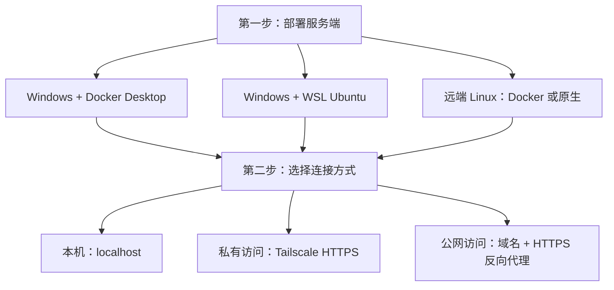

# 部署与连接：随时访问自己的 Amadeus

部署分成两步：**先在一台持续运行的电脑或服务器上启动服务，再选择如何从浏览器连接。** 手机和平板只需浏览器，不需要安装 Node.js、code-server 或 TeX Live。

## 先选路线

| 第一步：服务运行在哪里 | 推荐方式 | 第二步：如何连接 |
| --- | --- | --- |
| Windows 电脑 | Docker Desktop，配置最少 | 本机浏览器，或 Tailscale HTTPS |
| Windows 的 WSL Ubuntu | 原生安装，适合自行维护 Linux 环境 | 本机浏览器，或 Windows 上的 Tailscale HTTPS |
| 远端 Linux 服务器 | Docker Compose；也可按本文原生安装 | Tailscale HTTPS，或公网域名 + HTTPS |

### 版本说明

当前正式版是 **v1.2.0**，包含只读 AI 浏览器、每对话独立 Chromium、编辑器 PDF 选区注释和注释交互修复。DSH 固定依赖 `0.2.1-alpha.1`，仍为上游 alpha 预发布版；升级前备份配置、工作区与数据卷。

当前部署固定使用 Node.js **24**、code-server **4.104.2**、LaTeX Workshop **10.9.0**。补丁针对这些版本，请先按文档安装，避免自行换成 code-server 或扩展的最新版本。

## 第一步 A：Windows + Docker Desktop

### A1. 准备软件

安装 [Git for Windows](https://git-scm.com/downloads/win) 和 [Docker Desktop](https://docs.docker.com/desktop/setup/install/windows-install/)。Docker Desktop 使用 **Linux containers**，推荐 WSL 2 后端；按安装器要求启用虚拟化并重启电脑。

打开 Docker Desktop，等待引擎就绪。在 PowerShell 验证：

~~~powershell
git --version
docker version
docker compose version
~~~

`docker version` 应显示 Client 和 Server。只有 Client 或提示无法连接时，先启动 Docker Desktop。

### A2. 下载、配置和启动

在你希望保存项目的目录执行：

~~~powershell
git clone --branch v1.2.0 --depth 1 https://github.com/whyself/Amadeus.git
Set-Location Amadeus
Copy-Item amadeus.docker.example.yml amadeus.local.yml
New-Item -ItemType Directory -Force workspace
notepad amadeus.local.yml
~~~

把 `username` 改成自己的登录名，把 `password: CHANGE-ME` 改成足够长的独立密码。建议给 YAML 字符串加引号，例如 `password: '替换为自己的长密码'`。保留这些容器路径：

~~~yaml
host: 0.0.0.0
port: 3080
home: /data/dsh-home
workspace: /workspace
editor:
  upstream: http://127.0.0.1:8080
  bridgeDir: /data/editor/bridge
~~~

`0.0.0.0` 是容器内的监听地址。仓库的 Compose 仅向宿主机 `127.0.0.1:3080` 发布，不会因此直接向公网暴露。

~~~powershell
docker compose config --quiet
docker compose up -d --build
docker compose logs -f amadeus
~~~

第一次需要下载 Node 基础镜像、code-server、LaTeX Workshop、TeX Live 和浏览器资源，可能耗时较长。出现 `dsh web:` 启动日志后打开 <http://127.0.0.1:3080>。`Ctrl+C` 只退出日志查看，不停止容器。

Docker 镜像已经安装 TeX Live、中文字体和两项编辑器补丁，并自动把 Amadeus Bridge 与 LaTeX Workshop 放进持久扩展目录。无需在 Windows 上再安装这些依赖。

Docker Hub 基础镜像拉取失败时可尝试官方镜像的 AWS 镜像源：

~~~powershell
docker compose build --build-arg NODE_IMAGE=public.ecr.aws/docker/library/node:24-bookworm-slim
docker compose up -d
~~~

这只替换 Node 基础镜像来源，GitHub、Open VSX、Debian 等下载仍需能访问。

## 第一步 B：Windows + WSL Ubuntu 原生安装

这条路线自己管理 code-server 和 Amadeus 两个进程。以下面向 **Ubuntu 24.04、x86_64 或 ARM64**。Windows 普通 PowerShell 可执行：

~~~powershell
wsl --install -d Ubuntu-24.04
~~~

按提示重启，打开 Ubuntu 并创建普通 Linux 用户。之后本节所有 Bash 命令都在 Ubuntu 终端执行。项目放在 Linux 用户目录，例如 `~/Amadeus`，尽量不要放在 `/mnt/c` 下。

### B1. 安装 Node.js 24、编译工具和字体

`sudo` 用于安装系统软件；应用和编辑器用你的普通用户运行。

~~~bash
sudo apt-get update
sudo apt-get install -y ca-certificates curl git bash util-linux nano
curl -fsSL https://deb.nodesource.com/setup_24.x -o /tmp/amadeus-node24-setup.sh
sudo -E bash /tmp/amadeus-node24-setup.sh
sudo apt-get install -y nodejs texlive-xetex texlive-lang-chinese texlive-latex-extra texlive-pictures texlive-bibtex-extra latexmk biber fonts-noto-cjk fonts-dejavu-core
node --version
npm --version
~~~

`node --version` 应为 `v24.x.x`。下载或安装失败时不要直接继续后面的步骤。

### B2. 构建 Amadeus

~~~bash
git clone --branch v1.2.0 --depth 1 https://github.com/whyself/Amadeus.git
cd Amadeus
npm ci
npm run build
sudo npm run setup:browsers -- --deps-only
npm run setup:browsers
~~~

最后两步分别安装 DSH 官方 browser use 插件所需系统库和当前用户的 Chromium，安装版本与插件运行时一致。若明确不需要内置浏览器自动化，可省略这两步，并在 B4 配置中增加 `browserUse: { enabled: false }`。

### B3. 安装固定版本的 code-server 与扩展，应用补丁

保持终端当前目录为 `~/Amadeus`：

~~~bash
case "$(uname -m)" in
  x86_64) amadeus_arch=amd64 ;;
  aarch64|arm64) amadeus_arch=arm64 ;;
  *) echo '本教程仅支持 x86_64 或 ARM64'; exit 1 ;;
esac
amadeus_code_dir="$HOME/.local/lib/code-server-4.104.2"
amadeus_editor_data="$HOME/.local/share/amadeus/code-server"
amadeus_extensions="$amadeus_editor_data/extensions"
mkdir -p "$amadeus_code_dir" "$amadeus_editor_data/User" "$amadeus_extensions"
curl -fL "https://github.com/coder/code-server/releases/download/v4.104.2/code-server-4.104.2-linux-$amadeus_arch.tar.gz" -o /tmp/amadeus-code-server.tar.gz
tar -xzf /tmp/amadeus-code-server.tar.gz --strip-components=1 -C "$amadeus_code_dir"
curl -fL https://open-vsx.org/api/James-Yu/latex-workshop/10.9.0/file/James-Yu.latex-workshop-10.9.0.vsix -o /tmp/amadeus-latex-workshop.vsix
"$amadeus_code_dir/bin/code-server" --user-data-dir "$amadeus_editor_data" --extensions-dir "$amadeus_extensions" --install-extension /tmp/amadeus-latex-workshop.vsix
cp -a packages/editor/extension "$amadeus_extensions/amadeus.amadeus-bridge-1.0.0"
node scripts/patch-code-server.mjs "$amadeus_code_dir"
amadeus_latex_dir="$(find "$amadeus_extensions" -maxdepth 1 -type d -name 'james-yu.latex-workshop-10.9.0*' -print -quit)"
test -n "$amadeus_latex_dir"
node scripts/patch-latex-workshop.mjs "$amadeus_latex_dir"
cp deploy/code-server-settings.json "$amadeus_editor_data/User/settings.json"
~~~

确认每条命令成功后再继续。两个补丁分别修复按文件更新编辑器模型、以及 LaTeX PDF 的代理资源与快捷键处理。Bridge 是 Amadeus 与编辑器交换状态和选区的必要扩展。已有 VS Code 设置的用户应合并设置内容，避免直接覆盖自己的 `settings.json`；全新部署可按上面复制。

### B4. 创建配置

~~~bash
mkdir -p "$HOME/Amadeus-workspace" "$HOME/.local/share/amadeus/bridge"
cp amadeus.example.yml amadeus.local.yml
nano amadeus.local.yml
~~~

把下面的 `/home/你的用户` 换成 `echo "$HOME"` 显示的真实绝对路径；用户名与密码也要修改：

~~~yaml
username: amadeus
password: '替换为自己的长密码'
host: 127.0.0.1
port: 3080
home: /home/你的用户/.local/share/amadeus/dsh-home
workspace: /home/你的用户/Amadeus-workspace
sessionHours: 12
maxUploadBytes: 1073741824
maxPreviewBytes: 268435456
editor:
  upstream: http://127.0.0.1:8080
  bridgeDir: /home/你的用户/.local/share/amadeus/bridge
browserUse:
  enabled: true
  mode: launch
  headless: true
~~~

YAML 不会自动展开 `$HOME` 或 `~`。`editor.bridgeDir` 与启动 code-server 时的 `AMADEUS_EDITOR_BRIDGE_DIR` 必须指向**同一个绝对目录**，并且由同一个用户读写；否则编辑器画面可能能打开，但 Bridge 一直显示未连接。

~~~bash
chmod 600 amadeus.local.yml
~~~

### B5. 先用两个终端验证

第一个 Ubuntu 终端启动编辑器：

~~~bash
export AMADEUS_EDITOR_BRIDGE_DIR="$HOME/.local/share/amadeus/bridge"
"$HOME/.local/lib/code-server-4.104.2/bin/code-server" --bind-addr 127.0.0.1:8080 --auth none --disable-telemetry --disable-update-check --disable-workspace-trust --user-data-dir "$HOME/.local/share/amadeus/code-server" --extensions-dir "$HOME/.local/share/amadeus/code-server/extensions" "$HOME/Amadeus-workspace"
~~~

第二个 Ubuntu 终端启动 Amadeus：

~~~bash
cd "$HOME/Amadeus"
export AMADEUS_CONFIG="$PWD/amadeus.local.yml"
export AMADEUS_EDITOR_BRIDGE_DIR="$HOME/.local/share/amadeus/bridge"
npm start
~~~

从 Windows 浏览器访问 <http://127.0.0.1:3080>，登录后新建会话、设置工作区并打开一个文件的编辑按钮。编辑器连上后尝试保存一行文字，确认能在工作区找到文件。

两个终端关闭、Windows 休眠或 WSL 停止时服务也会停止。需要持续运行时，可用下面的 systemd 用户服务；WSL 中应先用 `systemctl --version` 和 `systemctl --user status` 确认 systemd 可用。WSL 的 systemd 启用方法见 [Microsoft 文档](https://learn.microsoft.com/windows/wsl/systemd)。它不负责唤醒已关机或休眠的 Windows 电脑。

### B6. 可选：设置 systemd 用户服务

先在两个前台终端按 `Ctrl+C` 停止进程，再在普通用户的 Ubuntu 终端执行：

~~~bash
mkdir -p "$HOME/.config/systemd/user"
cat > "$HOME/.config/systemd/user/amadeus-editor.service" <<EOF
[Unit]
Description=Amadeus code-server
After=network.target

[Service]
Environment=AMADEUS_EDITOR_BRIDGE_DIR=$HOME/.local/share/amadeus/bridge
ExecStart=$HOME/.local/lib/code-server-4.104.2/bin/code-server --bind-addr 127.0.0.1:8080 --auth none --disable-telemetry --disable-update-check --disable-workspace-trust --user-data-dir $HOME/.local/share/amadeus/code-server --extensions-dir $HOME/.local/share/amadeus/code-server/extensions $HOME/Amadeus-workspace
Restart=on-failure
RestartSec=5
UMask=0077

[Install]
WantedBy=default.target
EOF
cat > "$HOME/.config/systemd/user/amadeus.service" <<EOF
[Unit]
Description=Amadeus
After=network.target amadeus-editor.service
Requires=amadeus-editor.service

[Service]
WorkingDirectory=$HOME/Amadeus
Environment=NODE_ENV=production
Environment=AMADEUS_CONFIG=$HOME/Amadeus/amadeus.local.yml
Environment=AMADEUS_EDITOR_BRIDGE_DIR=$HOME/.local/share/amadeus/bridge
ExecStart=$(command -v node) $HOME/Amadeus/scripts/start.mjs
Restart=on-failure
RestartSec=5
UMask=0077

[Install]
WantedBy=default.target
EOF
sudo loginctl enable-linger "$USER"
systemctl --user daemon-reload
systemctl --user enable --now amadeus-editor.service amadeus.service
journalctl --user -u amadeus -u amadeus-editor -f
~~~

这些服务使用普通用户权限。路径约定为上面的默认目录，用户名和路径不应含空格；换目录时要同时修改配置和两个服务文件。服务器启动时两项服务自动运行；code-server 初次启动略有延迟时，前端可等待或重试连接。

## 第一步 C：远端 Linux 服务器

准备一台能长期运行的 Linux 服务器，通过 SSH 登录。推荐 Ubuntu 24.04；应用运行身份使用普通用户。

### C1. 推荐：Docker Compose

Ubuntu 24.04 可按 [Docker Ubuntu 安装文档](https://docs.docker.com/engine/install/ubuntu/)安装官方仓库中的 Engine 与 Compose 插件。全新服务器执行：

~~~bash
sudo apt-get update
sudo apt-get install -y ca-certificates curl git nano
sudo install -m 0755 -d /etc/apt/keyrings
sudo curl -fsSL https://download.docker.com/linux/ubuntu/gpg -o /etc/apt/keyrings/docker.asc
sudo chmod a+r /etc/apt/keyrings/docker.asc
amadeus_ubuntu_codename="$(. /etc/os-release && echo "$VERSION_CODENAME")"
amadeus_debian_arch="$(dpkg --print-architecture)"
echo "deb [arch=$amadeus_debian_arch signed-by=/etc/apt/keyrings/docker.asc] https://download.docker.com/linux/ubuntu $amadeus_ubuntu_codename stable" | sudo tee /etc/apt/sources.list.d/docker.list > /dev/null
sudo apt-get update
sudo apt-get install -y docker-ce docker-ce-cli containerd.io docker-buildx-plugin docker-compose-plugin
sudo systemctl enable --now docker
sudo docker version
sudo docker compose version
~~~

已安装其他 Docker 发行包时，先按官方文档处理包冲突，不要重复安装。后续 `docker compose` 若没有权限请加 `sudo`。确认版本命令可用后：

~~~bash
git clone --branch v1.2.0 --depth 1 https://github.com/whyself/Amadeus.git
cd Amadeus
cp amadeus.docker.example.yml amadeus.local.yml
mkdir -p workspace
nano amadeus.local.yml
chmod 600 amadeus.local.yml
~~~

修改登录凭据，保留 Docker 示例中的容器路径。镜像以 UID **1000** 的 `node` 用户运行；Linux 绑定目录必须允许该 UID 写入。全新、专用于 Amadeus 的工作区可设置为：

~~~bash
sudo chown 1000:1000 workspace
~~~

如果 Docker CLI 要求权限，可在 `docker compose` 前使用 `sudo`；这不会把容器内应用改成 root。已有工作区应按自己的所有权或 ACL 规则授予 UID 1000 读写权限，不要直接递归改动其他项目。

`chmod 600` 后，配置也必须能由容器 UID 1000 读取。若 `id -u` 不是 `1000`，可保留原所有者，仅给容器增加读取 ACL：

~~~bash
sudo apt-get install -y acl
sudo setfacl -m u:1000:r amadeus.local.yml
~~~

确认配置与工作区权限后启动：

~~~bash
docker compose up -d --build
docker compose logs -f amadeus
~~~

此时远端服务器上的 <http://127.0.0.1:3080> 能访问服务，但你电脑上的 `127.0.0.1` 是你自己的电脑。继续选择第二步的 Tailscale 或公网域名访问。

### C2. 可选：Linux 原生

不使用 Docker 时，以普通 SSH 用户完整执行 B1～B6，跳过 Windows 与 WSL 的准备步骤。软件、补丁、Bridge 和配置一致；服务器上不要用 root 运行 `npm start` 或 `code-server`。确保用户的 home 目录存在，启用 linger 后用户服务才能在退出 SSH 后继续运行。

仓库另有 `deploy/amadeus.service` 系统服务模板，默认用户为 `amadeus`、应用目录为 `/srv/amadeus`。它**只启动 Amadeus**，不会替你启动 code-server；不要同时启用本文用户服务和该模板，以免抢占端口。

## 第二步 A：本机直接连接

同一台 Windows/Docker 或 WSL 主机的浏览器访问 <http://127.0.0.1:3080> 即可。远端 Linux 可以临时通过 SSH 隧道连接：

~~~bash
ssh -L 3080:127.0.0.1:3080 你的用户@服务器地址
~~~

保持 SSH 连接，再在本机打开 <http://127.0.0.1:3080>。如果本机 3080 已被占用，可把命令左侧端口改成 `3081`，再访问 `http://127.0.0.1:3081`。

首次登录后，在 DSH 设置中配置自己的模型提供商、API 地址与密钥，再开始聊天。Amadeus 的网页登录密码和模型 API 密钥是两种不同配置。

## 第二步 B：Tailscale 私有 HTTPS 访问

[Tailscale](https://tailscale.com/download) 让你的电脑、服务器、手机和平板进入一个私有网络，通常不需要在路由器开放入站端口。要访问的客户端也必须加入有访问权限的 tailnet。这里使用 **Serve**，不启用对公网开放的 Funnel。

### B1. 准备主机与客户端

1. 在服务端安装 Tailscale 并登录。Windows 部署时建议装在 **Windows 主机上**；Linux 服务器装在 Linux 上。
2. 在手机、iPad 或其他电脑安装 Tailscale，登录同一 tailnet，或由管理员授权访问。
3. 在 Tailscale 管理后台确认 MagicDNS 与 HTTPS Certificates 已启用；按首次运行 Serve 的提示完成授权。

Linux 主机可按 [官方安装页](https://tailscale.com/download/linux)安装，然后运行：

~~~bash
sudo tailscale up
curl -I http://127.0.0.1:3080
sudo tailscale serve --bg http://127.0.0.1:3080
sudo tailscale serve status
~~~

Windows 在 PowerShell 运行：

~~~powershell
curl.exe -I http://127.0.0.1:3080
tailscale serve --bg http://127.0.0.1:3080
tailscale serve status
~~~

`curl` 收到 `401 Unauthorized` 通常说明已经连到了需要登录的 Amadeus。若 Windows 找不到 `tailscale`，重新打开终端，或调用 `& "$env:ProgramFiles\Tailscale\tailscale.exe"`。

**WSL 路线有一个前提：Windows 必须先能访问 WSL 中的 `http://127.0.0.1:3080`。** Serve 在 Windows 上代理 Windows 的 localhost。先确认 WSL 正在运行、服务已启动、WSL localhost 转发未被禁用，再设置 Serve。WSL localhost 转发与网络模式说明见 [Microsoft WSL 网络文档](https://learn.microsoft.com/windows/wsl/networking)。不能本机连通时，Serve 也无法替你连通。

### B2. 从手机或平板打开

使用 `tailscale serve status` 输出的真实地址，例如：

~~~text
https://你的设备名.你的tailnet.ts.net/
~~~

客户端连接 Tailscale 后，在浏览器打开这个 HTTPS 地址，输入 Amadeus 登录凭据。支持安装的浏览器可安装 PWA；iPad Safari 可从“分享 → 添加到主屏幕”进入独立窗口。更新后的 Safari 兼容与 PWA 可以同时使用，安装入口保留。

服务端需要保持开机，Windows 不应进入休眠。Tailscale 不会自动唤醒你的电脑。查看或撤销本次代理：

~~~text
tailscale serve status
tailscale serve reset
~~~

`reset` 会清除该设备的全部 Serve 配置；同一台机器有其他 Serve 服务时请先核对。

## 第二步 C：公网域名 + HTTPS 反向代理

适合有公网 IP 的 Linux 服务器，客户端无需 Tailscale。需要域名、DNS 记录和有效证书。家用电脑走这条路线还需要公网地址、路由转发或另行提供的公网代理；仅填写域名不能解决运营商 NAT。

下面以 Ubuntu 24.04、Nginx、域名 `amadeus.example.com` 为例。将域名替换为自己的，并把 DNS A/AAAA 指向这台服务器。云安全组/防火墙允许 TCP **80、443**；保持 3080 和无密码编辑器 8080 不对公网开放。

### C1. 创建 HTTP 入口并申请证书

~~~bash
sudo apt-get update
sudo apt-get install -y nginx certbot python3-certbot-nginx
sudo nano /etc/nginx/sites-available/amadeus
~~~

写入以下配置：

~~~nginx
server {
    listen 80;
    server_name amadeus.example.com;
    client_max_body_size 1024m;

    location / {
        proxy_pass http://127.0.0.1:3080;
        proxy_http_version 1.1;
        proxy_set_header Host $http_host;
        proxy_set_header X-Forwarded-Proto $scheme;
        proxy_set_header X-Real-IP $remote_addr;
        proxy_set_header Upgrade $http_upgrade;
        proxy_set_header Connection "upgrade";
        proxy_read_timeout 3600s;
        proxy_send_timeout 3600s;
        proxy_buffering off;
        proxy_request_buffering off;
    }
}
~~~

~~~bash
sudo ln -s /etc/nginx/sites-available/amadeus /etc/nginx/sites-enabled/amadeus
sudo nginx -t
sudo systemctl reload nginx
sudo certbot --nginx -d amadeus.example.com --redirect
sudo nginx -t
sudo certbot renew --dry-run
~~~

`certbot` 会询问联系邮箱、申请证书并将 HTTP 重定向到 HTTPS。证书验证要求 DNS 已正确解析，外部能访问 80 端口；使用已有站点时应合并配置，不要重复添加同一个域名的 `server` 块。正式登录使用 `https://amadeus.example.com`。

### C2. 为什么必须转发 WebSocket

聊天连接、终端和内嵌编辑器都依赖 WebSocket。缺少 `Upgrade`、`Connection` 或使用了错误的代理 HTTP 版本时，常见现象是主页能打开，但聊天反复断线、编辑器一直连接中。上面的配置包含转发和长连接超时；仅把普通网页代理过去不够。

已有 HTTPS 站点可直接参照 [nginx.conf.example](../deploy/nginx.conf.example)。请保留 Amadeus 登录认证，并通过 HTTPS 传输凭据。无密码 code-server 只监听 `127.0.0.1:8080`，浏览器通过 Amadeus 的认证代理访问它。

## 数据、备份和更新

### 配置与路径的真实含义

| 参数或位置 | Docker | 原生安装 |
| --- | --- | --- |
| 私有配置 | `AMADEUS_CONFIG=/config/amadeus.yml`，挂载自 `amadeus.local.yml` | `AMADEUS_CONFIG` 优先；未指定时读取仓库内 `amadeus.local.yml` |
| DSH 会话与设置 | `/data/dsh-home` | 配置 `home`；省略时为仓库 `.amadeus/dsh-home` |
| 工作区 | 宿主机 `workspace/` | 配置 `workspace`；省略时为仓库目录 |
| 编辑器用户数据 | `/data/code-server` | 本文 `$HOME/.local/share/amadeus/code-server` |
| Bridge 通信 | 两个进程共用 `/data/editor/bridge` | YAML 与 code-server 环境变量共用本文的 `bridge` 目录 |

原生相对路径由启动命令的当前工作目录解析，推荐用绝对路径。`home` 不是工作区：只复制工作区不能恢复聊天和模型设置。服务首次启动创建 `amadeus` profile，后续继续复用；不要把生成的 `amadeus.cordis.patch.yml` 当作私有配置去编辑。

### Docker 备份

需要保存 **私有配置、工作区、`/data` 命名卷**。备份前停止服务，保证三部分处于同一时间点。下面在项目目录运行，使用临时容器归档，兼容 Windows；临时归档进程使用 root 来读取卷，平时服务仍以 `node` 用户运行。

PowerShell：

~~~powershell
docker compose stop
New-Item -ItemType Directory -Force tmp/backup
$amadeusBackupPath = (Resolve-Path tmp/backup).Path
Copy-Item amadeus.local.yml tmp/backup/amadeus.local.yml
docker compose run --rm --no-deps --user root --entrypoint tar --volume "${amadeusBackupPath}:/backup" amadeus -czf /backup/data.tar.gz -C /data .
docker compose run --rm --no-deps --user root --entrypoint tar --volume "${amadeusBackupPath}:/backup" amadeus -czf /backup/workspace.tar.gz -C /workspace .
docker compose start
~~~

Bash：

~~~bash
docker compose stop
mkdir -p tmp/backup
cp amadeus.local.yml tmp/backup/amadeus.local.yml
docker compose run --rm --no-deps --user root --entrypoint tar --volume "$PWD/tmp/backup:/backup" amadeus -czf /backup/data.tar.gz -C /data .
docker compose run --rm --no-deps --user root --entrypoint tar --volume "$PWD/tmp/backup:/backup" amadeus -czf /backup/workspace.tar.gz -C /workspace .
docker compose start
~~~

如果任何归档命令失败，请先解决并重新备份，再升级。把 `tmp/backup/` 整体复制到另一块磁盘或可靠存储；它包含密码、模型凭据和聊天，应作为私有数据保存。仓库已忽略 `tmp/`，不要强制加入 Git。再次备份会覆盖同名归档，可改为带日期的目录。

恢复到新建的空工作区和空数据卷时，先放回配置和归档，停止服务，然后用相同临时容器将 `data.tar.gz` 解压到 `/data`、`workspace.tar.gz` 解压到 `/workspace`：将对应命令中的 `-czf /backup/文件名 -C 目标 .` 改为 `-xzf /backup/文件名 -C 目标`。不要向有新数据的卷直接解压覆盖。新建空卷可先执行 `docker compose create`；恢复前不要运行会初始化数据的服务。

### 升级

保持原项目目录与 Compose 项目名，继续使用原配置、`workspace/` 和命名卷。`docker compose down` 保留卷，**`docker compose down -v` 会删除卷**。

~~~bash
git fetch origin tag v1.2.0
git fetch --tags
git switch --detach v1.2.0
docker compose up -d --build
~~~

这里演示切换当前正式版标签；新版本发布后替换标签。升级到主分支已合入的未发布改动，可依次执行 `git fetch origin main`、`git switch --detach FETCH_HEAD` 后重新构建。按标签浅克隆的仓库可能没有 `origin/main`，因此这里直接使用刚抓取的提交。请先确认没有自己的源代码修改。服务不会强制刷新正在编辑的浏览器；保存内容后自行刷新页面。

原生升级还需重新构建并更新 Bridge：

~~~bash
cd "$HOME/Amadeus"
npm ci
npm run build
cp -a packages/editor/extension/. "$HOME/.local/share/amadeus/code-server/extensions/amadeus.amadeus-bridge-1.0.0/"
node scripts/patch-code-server.mjs "$HOME/.local/lib/code-server-4.104.2"
amadeus_latex_dir="$(find "$HOME/.local/share/amadeus/code-server/extensions" -maxdepth 1 -type d -name 'james-yu.latex-workshop-10.9.0*' -print -quit)"
node scripts/patch-latex-workshop.mjs "$amadeus_latex_dir"
systemctl --user restart amadeus-editor amadeus
~~~

先停止服务、备份 `$HOME/.local/share/amadeus`、工作区及私有配置，再切换版本并执行上面的原生步骤。不使用 systemd 时，停止两个前台进程后按 B5 重开。旧 Windows 绝对文件路径不会自动变成 Linux 或 Docker 路径，迁移后需重新选择工作区。

## 常见问题

| 现象 | 先检查 |
| --- | --- |
| 本机打不开 3080 | `docker compose ps` / 日志；原生检查两个终端或 `journalctl --user` |
| 登录启动失败 | 私有配置是否可读，是否还保留 `CHANGE-ME`，YAML 是否有语法错误 |
| 文件无法创建或保存 | Linux 工作区权限；Docker 的 UID 1000 是否可写 |
| 编辑器画面出现但 Bridge 未连接 | 扩展是否安装；环境变量与 YAML 是否共用 Bridge 目录；code-server 是否已重启 |
| Windows 能打开，Tailscale 地址不能 | Serve 状态、客户端 Tailscale 连接、tailnet 访问策略；WSL 场景先验证 Windows localhost |
| 公网主页正常，聊天或编辑器断线 | HTTPS 代理是否转发 WebSocket，是否存在额外代理超时 |
| LaTeX 中文编译失败 | TeX Live 中文包、字体和固定的 LaTeX Workshop；检查编译日志 |
| 安装 PWA 后仍看到旧界面 | 先保存工作并重新打开/刷新；确认部署版本，不要仅重启旧镜像 |

Amadeus 是单用户工作台，登录后可以访问工作区和终端。访问方式只决定你如何连接，不能把一台单用户服务变成多个互相隔离的用户空间。

文档结构参考 [YeJingchen 的部署指南贡献](https://github.com/YJC18368291437-ai/Amadeus/commit/da370a168fbfaa9b25dbc70fff03fdff3f3de233)，按主仓库实际脚本与配置重写；贡献来源见 [CONTRIBUTORS.md](../CONTRIBUTORS.md)。
