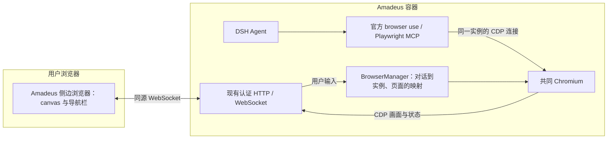

# Amadeus 共同浏览器规划

日期：2026-10-08。范围：当前 Web / Docker Compose 部署。本文是后续实现规划，没有实现画面传输或改变现有运行服务。

## 1. 建议与目标

在现有 Amadeus 容器内运行共同 Chromium，由服务端统一管理；每个普通对话对应独立实例。用户的侧边栏和该对话的 AI 都操作同一个实例中的同一个页面。侧边栏通过 CDP 画面帧和认证 WebSocket 显示页面。

参考 ZCode 的实例归属、页面身份、打开事件、可见性与实例生命周期分离。Web 环境用 canvas 查看器承担 ZCode Electron webview 的显示职责。保留 Amadeus 已引入的官方 Playwright browser use 及其 MCP 工具，不复制 ZCode 的整套工具协议。

成功标准：用户在侧边栏输入的表单或登录状态，AI 下一次读取页面可以直接看到；AI 的点击、输入、页面导航和页面切换，用户在对应侧边栏直接看到。两者没有另外加载一份目标网页。

## 2. ZCode 中已核对的做法

参考提交：`zai-org/ZCode@29628c9acdb81b703bbd4080c207a0e7ce5e276e`。

| ZCode 实现 | Amadeus 对应方案 |
| --- | --- |
| `UnifiedBrowserView` 显示稳定的 webview guest，主进程对同一个 guest 挂 CDP | 查看器显示稳定 target 的帧，服务端与 AI 对同一 target 操作 |
| `BrowserGuestManager` 管理 tab、owner、browser generation 与 active tab | 小型 BrowserManager 保存对话、实例代次、页面及选中页面 |
| `ensureGuest` 通过 `onOpenTabRequested` 请求打开对应视图 | 实例或页面准备好后发布 `browser/reveal` 事件 |
| `selectTab(..., true)` 更新 active tab，再通知视图可见性 | 明确激活页面时同步 AI 所选页面，再更新侧边栏页面 |
| `openBrowserUseSidePane` 按 tab 身份复用；只为当前任务展开 | 按对话复用浏览器面板，后台对话只更新自己的状态 |
| 隐藏保留 guest，普通 turn end 不自动关闭页面 | 收起面板停止画面发送，页面继续运行；回答结束保留实例 |

应借鉴这些规则和接口划分。Electron guest attach、原生截图 surface、窗口 IPC、guest 驻留预算等无需整套搬入 Web 产品。

## 3. 实例放在哪里



- **进程**：同一容器内的 Chromium 子进程，继续使用插件固定版本的 Chromium。
- **网络**：CDP 仅在容器回环地址监听，使用动态端口；Compose 继续只发布 Amadeus 的 3080 端口。
- **数据**：在现有 `/data` 卷内使用 `<DSH_HOME>/browser/profiles/<opaque-session-key>/`；Cookie 按对话独立保存。
- **归属**：BrowserManager 拥有 Chromium；官方插件拥有对该实例的会话连接。关闭 AI 连接不等于关闭用户浏览器。
- **创建时间**：第一期在对话的浏览器运行时首次激活，或用户主动打开浏览器时创建，后续工具调用复用。准备实例不自动展开 UI。首轮可以跟随官方 Agent 初始化准备实例，不额外实现复杂的首次工具才启动机制。
- **释放时间**：删除对话、显式“结束浏览器”或服务关闭时释放。普通回答结束、侧栏收起、切换对话不释放。第一期不加入复杂的内存预算与自动闲置回收。
- **重启**：进程和未提交表单无法恢复；保存 Cookie、URL、标题与页面列表。用户点击恢复或 AI 明确导航时重新载入页面，并递增实例代次。
- **子代理**：第一期不继承普通对话的共同实例；避免子代理与用户同时操作同一页面。

采用同一容器即可。新增独立浏览器容器、Xvfb、VNC 或桌面环境均不是当前方案的必要组成。

## 4. 官方插件需要怎样接入

**现有官方插件配置不能直接完成每对话共同实例的连接。** launch 模式没有公开实例端点；固定 endpoint 的 attach 模式只允许一个活动 Session 占用，并且不能随着 UI 切换对话转移所有权。

推荐对官方 provider/runtime 做小范围、可审查的源码扩展：让运行时为每个 Agent 获取其对话的连接描述，而非所有 Agent 使用同一组固定 endpoint 参数。复用官方工具发现、工具执行、串行队列、归属检查与连接清理。

拟增加的集成能力如下，这是拟新增接口，不是现有 DSH API：

1. `acquireConnection(agent, signal)`：由 BrowserManager 获取该对话的 Chromium，返回 endpoint、browserId、generation，以及归属此 Agent 激活的 release 函数。
2. 官方运行时使用此 endpoint 启动该 Agent 的 Playwright MCP 连接；释放时先停止新调用、等待已有调用清理，再释放连接租约。
3. 实例本身仍归 BrowserManager；同一对话恢复新 Agent 时，先等待旧租约释放，再连接原实例或新代次实例。
4. 页面选择/操作完成后，提供明确的“当前受控页面”元数据，包含 CDP targetId。它与 UI 所选页面形成同一条事实来源。

对话到 endpoint 的动态绑定，以及 MCP 所选页面到 CDP targetId 的稳定映射，是阶段一必须解决的两项技术门槛。仅根据 URL 或浏览器页面数组下标猜测，会在相同 URL、多标签、弹窗时产生错误。

扩展以固定版本源码中的独立小改动维护，并优先向上游贡献。不要靠修改压缩后的 node_modules 文件、解析私有进程字段或复制一套完整 MCP 桥接器完成。

可先用未经修改的官方 attach 做单对话画面验证，但这个实验不能算多对话产品版本。第一期正式功能也不采用“所有对话共用一个固定 endpoint”。

## 5. 侧边栏如何打开

第一期保留一个用户可见的“浏览器”入口，复用现有 DSH 右侧栏。每个对话一个浏览器面板，面板内用简单页面标签条显示该实例的多个页面。

DSH 的 tab registry 支持 `priority: extension` 接管已有 `kind: browser`。Amadeus 插件注册自己的 body/title，替换该 kind 的页面载体；浏览器面板使用 `multiple: false` 复用一个面板。地址栏、前进、后退、刷新沿用现有产品样式和交互，通过 BrowserManager 操作受控页面。

**打开由服务端状态事件驱动，模型不必另外调用“打开侧边栏”工具。**

| 触发 | 服务端 | 用户界面 |
| --- | --- | --- |
| 用户点侧栏的“浏览器” | 获取当前对话实例；无页面时创建空白页 | 打开/复用该对话的浏览器面板，连接画面 |
| 用户点击聊天中的网页链接，偏好为应用内打开 | 在该对话实例中打开页面 | 展开面板，显示该页面 |
| 当前对话第一次执行实际浏览器导航/点击/输入 | 核对归属，准备页面，发布 reveal | 自动展开并选中该对话的浏览器面板 |
| AI 创建或明确选择新页面 | 同步 MCP selected page 与 targetId | 更新页面标签条，显示对应页面 |
| AI 持续点击、输入或读取同一页面 | 更新状态/画面 | 更新已有视图，不重复创建面板，不逐次抢焦点 |
| 后台对话使用浏览器 | 更新该对话状态 | 不切换当前对话；显示该对话的浏览器活动标记 |
| 用户在本轮手动收起侧栏 | 标记当前运行的 reveal 已被用户抑制 | 本轮后续普通操作不再次自动展开；主动打开仍有效 |
| 下一轮再次明确使用浏览器 | 本轮首次操作可发布新的 reveal | 恢复正常首次使用自动展开规则 |
| 仅 `web_search` / `web_fetch` 或浏览器工具目录发现 | 无页面展示事件 | 不自动展开浏览器 |

客户端只对 `sessionId === ctx.sidebarRight.mounted` 的事件调用现有 `openTab('browser', ...)` 或聚焦已有浏览器面板。后台事件保存到其对话的状态，不调用当前对话的打开函数。事件需幂等；重连或重复事件不创建重复面板。

浏览器页面的创建独立于 viewer 是否在线，AI 无需等待 UI 握手才能执行。断开电脑、收起侧栏或切换到文档时，AI 仍能运行。页面状态同步和画面传输应分别订阅。

## 6. 显示、输入与控制权

### 画面

- 第一版用 `Page.startScreencast` 的 JPEG 帧，经现有认证 WebSocket 发到 canvas；初始目标可设为质量 75，需实测后调整。
- 采用有界“只保留最新待发送帧”策略，及时 acknowledge CDP 帧；慢网络不累计旧画面。
- 面板不可见时停止该 viewer 的画面流；页面仍存在。重新打开时发送最新页面状态及画面。
- 初始使用固定 CSS viewport `1280 × 800`，侧栏缩放显示。拖动侧栏宽度不自动改变网站布局；之后再提供明确的 viewport 选择。
- 画面元数据包含 viewport 尺寸及必要的坐标变换信息，输入按真实页面坐标映射；不能假设 JPEG 像素与 CSS 像素始终一比一。

### 输入

- 第一版覆盖点击、滚动、键盘快捷键、文本与中文输入、页面导航和页面选择。
- canvas 上的 pointer 输入换算到 CDP 页面坐标；文本经输入捕获层发送 `Input.insertText`，组合输入不逐字符误发。
- 页面切换不仅改变 viewer：同步官方 MCP 的 selected page，使下一次没有显式页面参数的 AI 工具操作命中同一页面。

### 控制权

一个“AI 操作 / 用户接管”状态按钮。AI 操作期间用户可观看；用户发起接管后，服务端阻止新浏览器调用，等待已发出的调用结束，再确认交给用户。该等待状态必须可见；不能立即宣称已有操作停止。

用户接管期间，AI 浏览器调用返回结构化“用户正在操作”结果，避免执行排队的陈旧输入。交还 AI 时重新取页面快照，原有 DOM 引用及待发送操作不得直接复用。观看者可以有多个，输入租约同一时刻只有一个。

## 7. 最小状态与服务边界

第一期只维护必要身份与状态：

```text
SessionBrowser = sessionId + browserId + generation + process + privateEndpoint
BrowserPage    = browserId + generation + targetId + url + title
BrowserView    = sessionId + selectedTargetId + visible + suppressedRunId
InputLease     = browserId + generation + controller + revision
```

客户端收到的状态不包含 privateEndpoint。任何画面订阅或输入都需核对 session、generation、targetId 与控制租约；旧实例的迟到消息不得自动落到重启后的实例。

建议新增一个 `packages/browser` 插件，内部职责分为：

| 文件 | 职责 |
| --- | --- |
| `src/index.mjs` | Cordis 服务、现有认证路由/upgrade 注册、生命周期 |
| `src/manager.mjs` | Chromium 进程、对话归属、页面状态和连接租约 |
| `src/provider-bridge.mjs` | 官方运行时连接扩展与 selected page 元数据集成 |
| `src/stream.mjs` | CDP 帧、确认与有界发送 |
| `src/input.mjs` | 控制权、页面输入与导航 |
| `src/client.jsx` | browser kind 的接管、事件订阅、打开与复用 |
| `src/viewer.jsx` | canvas、输入捕获、页面标签条与状态提示 |
| `src/browser.css` | 沿用 DSH/Amadeus 主题的少量布局样式 |

服务路由拟为 `/amadeus/browser/state`、`/amadeus/browser/command` 和 `/amadeus/browser/stream`。全部复用现有 Amadeus 认证，内部 CDP 保持在回环地址。路线沿用 code-server 的同源 HTTP/WebSocket 接入，不新增公开浏览器端口。

## 8. 实施顺序与验收

### 阶段一：共同实例与官方插件桥接

- [ ] 建立 BrowserManager：在现有容器内为两个对话准备独立 Chromium。
- [ ] 增加官方运行时的会话连接获取/释放接口，复用其 MCP 生命周期与串行化。
- [ ] 建立 MCP selected page 与 targetId 映射，验证同 URL 页面和弹窗。
- [ ] 验证一个对话的两个 Agent 激活不会同时占有输入连接；第二个对话正常独立运行。
- [ ] 通过工具读取，确认用户侧直接修改的同一页面状态可见。

**验收门槛：** 每次 AI 操作都能明确定位共同实例和页面；切换对话不会串用连接。先完成这项，再开发完整 UI。

### 阶段二：只读画面与自动打开

- [ ] 增加认证画面流与 canvas。
- [ ] 接管现有浏览器入口；当前对话首次实际使用时自动打开，重复事件复用。
- [ ] 用户收起、后台对话、断网重连和服务重启按第 5 节规则处理。
- [ ] 两个客户端同时观看、慢网络背压、侧栏隐藏不累计帧。

**验收门槛：** 用户能实时看到 AI 的导航和页面变化；没有第二份目标网页；后台对话不抢当前侧栏。

### 阶段三：用户接管与页面选择

- [ ] 实现输入租约及“申请接管 → 等待已有操作结束 → 用户控制 → 交还 AI”。
- [ ] 接入鼠标、滚动、文本、中文输入和导航栏。
- [ ] 同步页面选择，支持两个相同 URL 页面与新窗口页面。
- [ ] 用本地测试表单验证用户输入后 AI 读到同一值，以及交还后的引用刷新。

**验收门槛：** 用户能填写登录表单后交还 AI；双方不并发输入；缩放和中文输入可用。

### 阶段四：兼容和部署收尾

- [ ] 原有 iframe 浏览器检查点保留 URL/title；提供明确的恢复操作，不自动批量加载所有旧页。
- [ ] 默认恢复时不承诺未提交表单、旧 DOM 引用或旧 Chromium 历史栈。
- [ ] 文档更新、完整 Docker 构建、真实 Web/PWA 运行验证及针对性复核。

第一期不包含桌面 computer use、视频录制、系统浏览器导入、自动账号共享和 ZCode 的整套资源驻留系统。文件上传/下载先沿用模型已有能力，用户侧浏览器上传/下载集成作为之后独立增量。

## 9. 参考源码

- [ZCode 统一视图](https://github.com/zai-org/ZCode/blob/29628c9acdb81b703bbd4080c207a0e7ce5e276e/packages/ui/src/browser-use/UnifiedBrowserView.tsx)
- [ZCode BrowserGuestManager：归属、打开、激活与生命周期](https://github.com/zai-org/ZCode/blob/29628c9acdb81b703bbd4080c207a0e7ce5e276e/packages/desktop/src/main/browserView/browserGuestManager.ts)
- [ZCode 侧边状态：幂等复用与当前任务展开](https://github.com/zai-org/ZCode/blob/29628c9acdb81b703bbd4080c207a0e7ce5e276e/packages/ui/src/lib/workspaceSidePane.ts)
- [DSH 官方运行时：Session 连接和串行执行](https://github.com/deepseek-ai/deepseek-harness/blob/5badb15009ae1756c3afe0ae0cef1faafc290ccc/packages/experimental/browser-use-runtime/src/mcp.ts)
- [DSH 侧边栏类型注册](https://github.com/deepseek-ai/deepseek-harness/blob/5badb15009ae1756c3afe0ae0cef1faafc290ccc/packages/client/ui-sidebar-right/src/client/tab-registry.ts)
- [已有官方插件整合记录](2026-10-08-official-browser-use.md)
